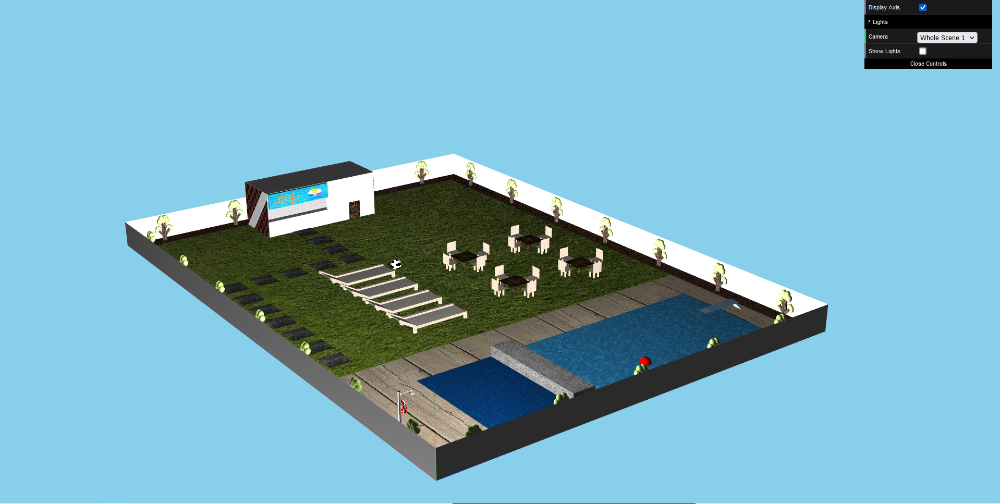
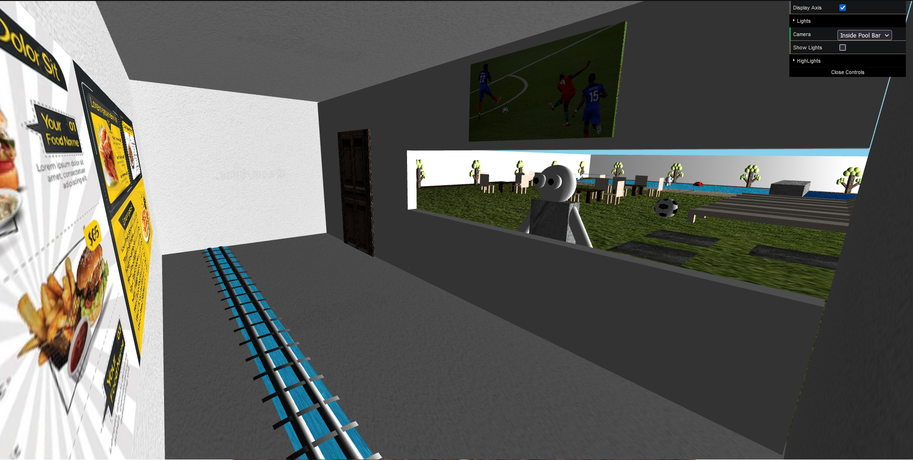

# SGI 2022/2023

## Group T03G10
| Name             | Number    | E-Mail             |
| ---------------- | --------- | ------------------ |
| Carlos Veríssimo | 201907716 | up201907716@up.pt |
| Miguel Amorim    | 201907756 | 201907756@up.pt |

----

## Projects

### [TP1 - Scene Graph](tp1)

#### **Scene**
  - Initial Idea
    
  - Our scene consists on a replication of a pool
  - [Link to the scene file](tp1/scenes/sgi_tp1_T03_G10.xml)
  - Below are the used primitives and some examples of how they were used:
    - **MyRectangle**
      - Tables and chairs by the pool
      - Walls
      - ...
    - **MyCylinder**
      - Table and chair legs
      - Tree branches and trunk
      - Shower
    - **MySphere**
      - Balls
      - Simulate tree leaves
    - **MyTorus**
      - Lifebuoy
    - **MyTriangle**
      - Pool bar sides

#### **Issues/Problems**

- There were some difficulties on getting the torus right, but at the end, we were happy with result.
- There were some misunderstanding related how the texture component should be specified, however, at the end everything became clear.

#### **Some Screenshots**

##### Top Left View

##### Bottom Right View

##### Pool Bar

##### Shower Details

-----

### [TP2 - WebGL Graphic Technique Usage](tp2)

Our scene is a recreation of a small town public pool. There are two water zones: a pool and a jacuzi, a big grass field with pool chairs and tables to enjoy the sun. There's also a bar and the pool is surrounded by a beautiful garden, filled with trees.

For the second assigment, focusing on graphic techniques, we added a few animations, two of them are related to two people that were added to the scene. The other one is the waving of a flag. We also added a water shader to the pool. Walls, previously made with rectangles, were replaced with patches to improve visibility.

[Link to the scene file](tp2/scenes/sgi_tp2_T03_G10.xml)

#### Strong points of our project

- Complex animations, that include interaction between diffrent objects, for example, a person kicks a ball and it goes into the pool, which then interacts with the pool/jacuzi divider.
- We make great use of the newly introduced primitive, the patch. It is used in many configurations, such as a flag, a barrel and even the walls of the scene.
- We took the opportunity to add a water shader to the pool, which is a very interesting effect.
- Besided the water shader, we also implemented shaders that highlight objects in the scene, through a periodical change in size and color of that object.
- We also took the opportunity to organize the folders and files in a more organized way, which makes it easier to navigate through the project.

##### Video showing a person diving into the pool

##### Using shaders to highlight objects

##### Using the patch to make a river passage

Outside the bar            |  Inside the bar
:-------------------------:|:-------------------------:
  |  

----

### [TP3 - ...](tp3)

- (items briefly describing main strong points)
