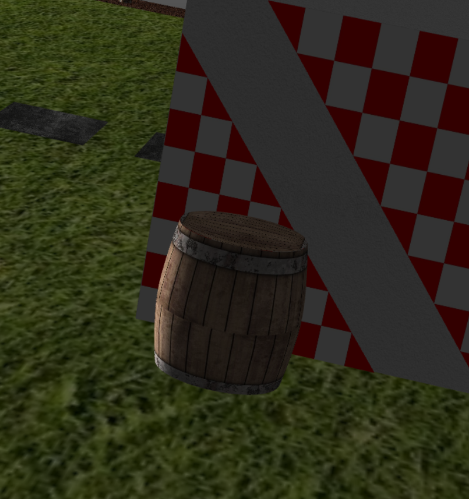
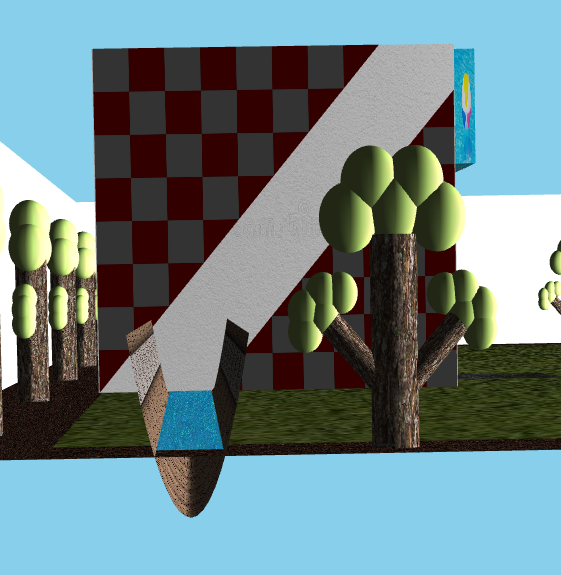
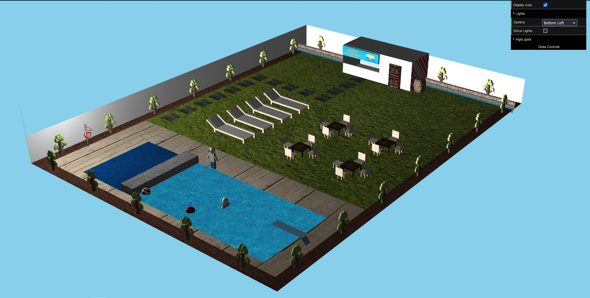

# SGI 2022/2023 - TP2

## Group T03G10

| Name              | Number    | Email            |
| ----------------- | --------- | ----------------- |
| Carlos Veríssimo | 201907716 | up201907716@up.pt |
| Miguel Amorim     | 201907756 | up201907756@up.pt   |

----
## Project information
- Scene
  - We've decided to build on top of the existing scene, created for the 1st assignment.
  - The scene consists of a public pool, with some caveats.
  - [Link to the scene file](scenes/sgi_tp2_T03_G10.xml)
- Animations
  - [A person kicks a football into the pool after a trip to the bar](#person-kicking-the-ball-into-the-pool)
  - [A person jumps to the pool from a board](#person-jumping-into-the-pool)
- Shaders
  - Using shaders, we highlighted objects in the scene, through a periodical change in size and color of that object.
    - [Lifebuoy](#highlights)
    - [Balls](#highlights)
  - A simple water shader was implemented using a [distortion map](scenes/images/textures/distortionmap.png) and can be visualized with detail at this [animation](#person-jumping-into-the-pool).
- New patch primtive
  - Used to create a [barrel](#barrel) by the side of the bar, and a tent-shaped river viaduct, that guides a river outside the bar.
    - Details of the river and viaduct can be seen [here](#river-viaduct-outside)
  - Replaced walls with retangle patch to improve visibility.
- Other
  - Added a tv inside the bar
  - Minor fixes

----
## Issues/Problems

- At the beggining, we had some issues understanding what was being asked relative to the shader part of the assignment, but, after talks with the teacher and monitor, everything was cleared up.
- Had some difficulties building the Barrel.

## Screenshots

#### **Barrel**

#### **River Viaduct (Outside)**

#### **River Viaduct (Inside)**

#### **Overview of the scene, at the start of the animations**

#### **Overview of the scene, after the animations were completed**

Even though it was not asked, we decided to include some videos demostrating the created animations and shaders, since screenshots won't don't do them justice.

#### **Person kicking the ball into the pool**

#### **Person jumping into the pool**

#### **Highlights**

**Lifebuoy**

**Balls**

