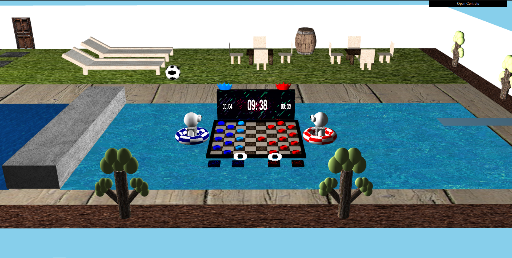
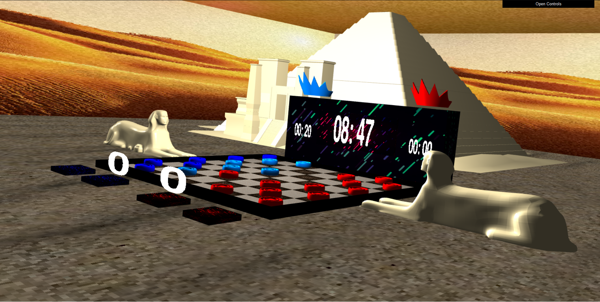
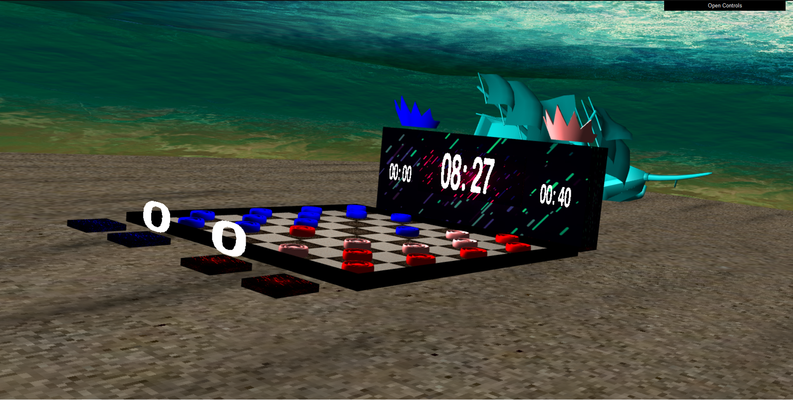
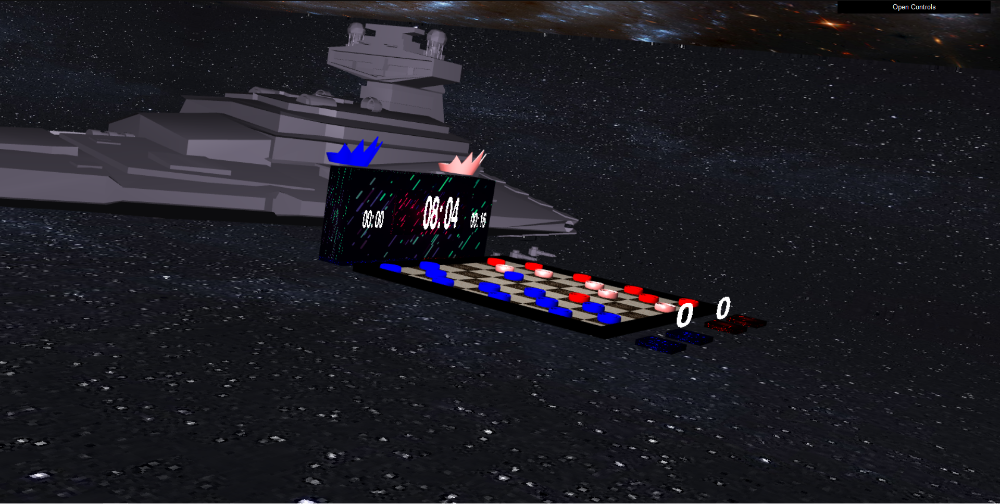
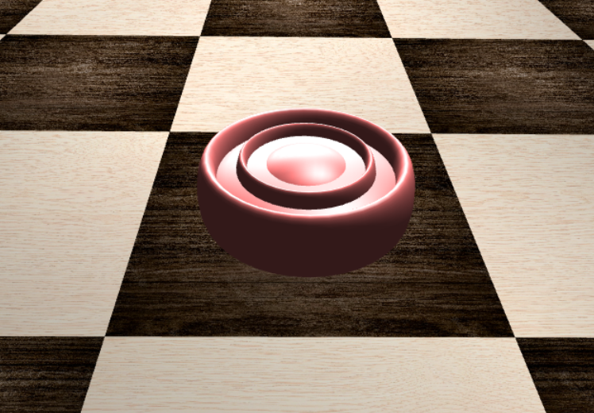
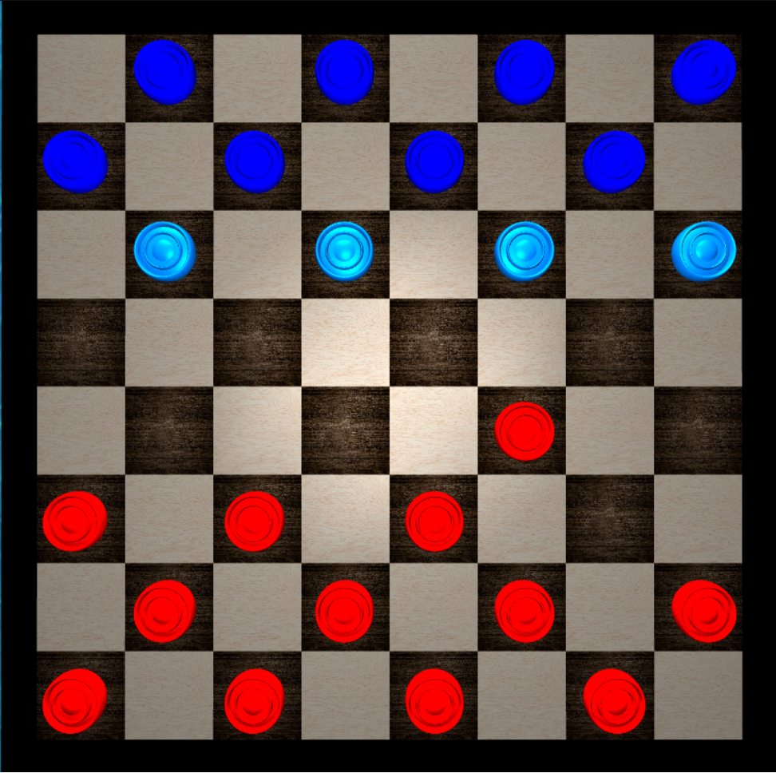
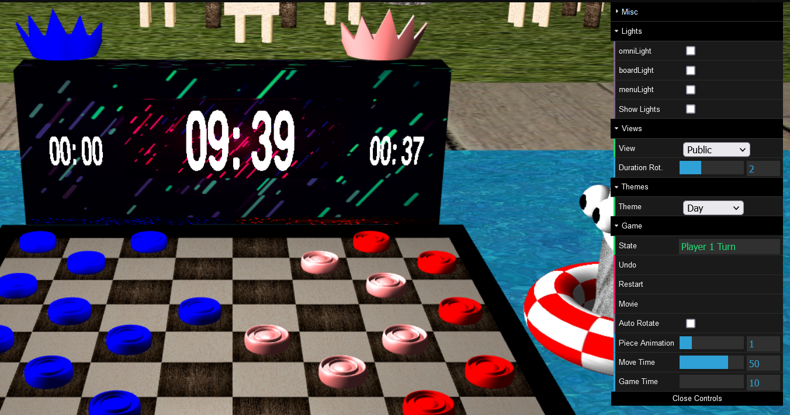

# SGI 2022/2023 - TP3

## Group T03G10

| Name              | Number    | Email              |
| ----------------- | --------- | ------------------ |
| Carlos Veríssimo  | 201907716 | up201907716@up.pt  |
| Miguel Amorim     | 201907756 | up201907756@up.pt  |
----

## Project information

  For the third and final project, a game of checkers was developed. The game is played by two players, each with 12 pieces, one red and one blue. The pieces move diagonally, one square at a time. If a player is able to jump an opponent's piece, the piece is removed from the board. The object of the game is to capture all of the opponent's pieces, or make them impossible to move.

### **Scene**

We took the pool scene devolped in the previous project, and made some changes to it. We made it smaller, and placed the board floating on the pool.

Link to the scene : [Pool](scenes/themes/pool_day.xml)

Here's an overview of the scene:

In addition to the scene describe above, 3 other scenes were developed, with different themes. The scenes are:

- [Desert](scenes/themes/desert.xml)

- [Underwater](scenes/themes/under_sea.xml)

- [Space](scenes/themes/space.xml)

 

------

#### **Main Points**

Some of the main points of the project include:
- Realistic rendering of the board and pieces (textures and materials).
- Smooth animations, including the arc-like movement of the eaten pieces to the deposit.
- Smooth transitions between the different views of the scene.
- Visual feedback when selecting a piece as well as the possible tiles to move to.
- Sound effects for the piece selection and movement.
- Interface that allows the user to configure some aspects of the game, some of them include:
  * Theme of the scene
  * Automatic rotation of the camera when the turn changes
  * Setting the duration of the transitions between the different views of the scene
  * Setting the duration of the animations of the pieces
  * Setting the total time of the game
  * Setting the time that the player has to make a move
- The interface also allows users to do the following actions:
  * Undo the last move
  * Restart the game
- Complex and visually modern timer system that displays the time remaining for each player, as well as the total time of the game.
- Spotlight that follows the movement of the moving piece.

## Issues/Problems

- There were a few issues throughout the development process as the project is relatively complex. Some edge cases had to be carefully handled, such as the cas in which the checker is what we called a "king" meaning it had two pieces on top of each other.

- There are also a few small bugs that we were not able to fix:
  * After the piece is done moving, it suddendly disappears for a split second before reappearing in the correct position. We believe that this is due to the fact the moving pieces are displayed relative to the origin of the scene, while the pieces that are not moving are displayed relative to the tile that they are on. This causes a small delay in the movement of the pieces, which is why the piece disappears for a split second.

## Some screenshots

**Checker Piece**:

 

**Board**

> Note that lighter colored checkers are the ones that can be moved.

 

**Timer and Interface**

> Lighter colored crowns represent the player that is currently playing.
